# Fashion & Commerce Design — Utopia of Eternity City

**Version:** 0.1 · **Date:** 8 มิถุนายน 2026  
**Scope:** เสื้อผ้า · รองเท้า · หมวก · เครื่องประดับ · ร้านค้าทั้งเมือง · เขตสันติ  
**สถานะ:** Design preview — **ยังไม่ Deploy** (ต้องสร้าง Skin ครบก่อน soft launch)

---

## 1. หลักการ

| กฎ | รายละเอียด |
|----|------------|
| **Cosmetic only** | ไม่มี stat / damage / speed buff |
| **IP-safe** | ชื่อและดีไซน์ใหม่เฉพาะโลก Utopia — แรงบันดาลใจจากวัฒนธรรม ไม่คัดลอกชุดขุนนาง/ตัวละครดัง |
| **เขตสันติ** | ร้านค้าทุกแห่งอยู่ใน **Commerce Peace Zone** — ห้าม PvP · ห้าม combat tool · ห้าม grief |
| **Deploy gate** | ก่อน publish ต้องมี Skin วางขายครบตาม tier ขั้นต่ำ (ดู §8) |
| **สไตล์หลัก** | Prism Solarpunk — pearl-white · gold filigree · cyan neon · purple aura |
| **Luxury vs Street** | ห้างในอาคาร (Mega Mall) = **3× Robux · ไม่ต้องมีกุญแจ** · ร้านข้างนอก = ราคาปกติ · **ต้อง Prism Key ตามเควส** |

**อ้างอิงภาพคอนเซปต์:** `docs/visual-ref/fashion/concepts/`

---

## 1B. สองระดับร้าน — Luxury Mall vs Street Shops

| ประเภท | ที่ตั้ง | ราคา | เงื่อนไขซื้อ |
|--------|---------|------|--------------|
| **Luxury Mall** | Aurora Mega Mall ในอาคาร · Eternity Luxury Galleria | **3×** ราคาฐาน | **ไม่ต้องทำเควส** — มี Robux พอซื้อได้ทันที |
| **Street Shops** | Canal · Marina · Sky Rail · Twilight Overpass | ราคาฐาน (1×) | ต้องสะสม **Prism Keys** ตาม `minPrismKeys` ต่อร้าน |

**เหตุผล:** ผู้เล่นใหม่ที่ต้องการ cosmetic ทันที → จ่าย premium ในห้าง · ผู้เล่นที่เล่นเควส → ได้ราคาถูกกว่าที่ร้านข้างนอก

**Code:** `PrismCommerceConfig.luau` · `CommerceShopService.server.luau`

---

## 2. ช่องสวมใส่ (Avatar Slots)

| Slot | ตัวอย่าง | จำนวนเป้าหมายปี 1 |
|------|----------|-------------------|
| `Shirt` / `Dress` | เสื้อ · ชุดเดรส · จั๊มสูท | 120+ |
| `Pants` / `Skirt` | กางเกง · กระโปรง · โรบ | 80+ |
| `Shoes` | รองเท้า · บูท · รองเท้าแตะ | 60+ |
| `Hat` / `Hair` | หมวก · ผม · มงกุฎ · ดอกไม้ | 80+ |
| `Face` | แว่น · หน้ากาก · makeup overlay | 40+ |
| `Neck` | สร้อย · ผ้าพันคอ · จี้ | 50+ |
| `Wrist` | กำไล · นาฬิกา | 30+ |
| `Back` | ปีกประดับ · ผ้าคลุม · กระเป๋า | 40+ |
| `Aura` | ออร่า · particle trail | 20+ |
| **Full Set Bundle** | ชุดครบ 5–8 ชิ้น | 100+ ชุด |

**รวมเป้าหมาย:** 500+ ไอเทมปีแรก (สอดคล้อง `Utopia Wardrobe` ใน GDD)

### Prism Teen Trend Line (+30 ชุด)

อ้างอิง DTI / Brookhaven / Royale High / Gen Z 2026 — ดู **`docs/TEEN-TREND-FASHION-RESEARCH.md`**  
Catalog: `TeenTrendFashionSets.luau` · ขายที่ **Prism Wardrobe**

---

## 3. แคตตาล็อกชุด — Signature Line (ขายตลอดปี)

ชุดประจำเมือง ไม่หมดอายุ — วางใน **Aurora Mega Mall** + **Canal Boutique Row**

| Set ID | ชื่อ | ชิ้นในชุด | ธีม |
|--------|------|-----------|-----|
| `prismwake_gala` | Prismwake Gala | Coat, Pants, Boots, Crown, Aura | ชุดทางการ signature เมือง |
| `canal_cruise` | Canal Cruise | Linen shirt, Wide pants, Sandals, Sun hat, Tote bag | ริมคลอง สบาย |
| `sky_rail_commuter` | Sky Rail Commuter | Jacket, Skirt/pants, Sneakers, Cap, Watch | สาย mono / hover |
| `marina_evening` | Marina Evening | Gown/suit, Heels/loafers, Clutch, Pearl necklace | ริมอ่าว ยามเย็น |
| `twilight_overpass` | Twilight Overpass | Hoodie glow-trim, Joggers, High-tops, Visor | สตรีท solarpunk |
| `eternity_artist` | Eternity Artist | Smock, Beret, Paint-splatter boots, Palette back | creator showcase |

**ราคา Bundle:** 799–1,499 Robux · แยกชิ้น 99–299 Robux

---

## 4. ชุดเทศกาล (Seasonal — Limited แล้วกลับ Legacy Shop)

| เทศกาล | ช่วง | Set ID | ชื่อชุด | ชิ้นหลัก |
|--------|------|--------|---------|----------|
| **ปีใหม่** | 1 ม.ค. | `spark_cascade` | Spark Cascade | Sequin dress/suit, party shoes, confetti aura, top hat |
| **ตรุษจีน** | ม.ค.–ก.พ. | `lantern_redream` | Lantern Redream | Brocade top, silk pants, embroidered shoes, lantern back |
| **สงกรานต์** | เม.ย. | `lotus_splash` | Lotus Splash | Water-silk top, sash, garland hat, splash aura |
| **ลอยกระทง** | พ.ย. | `riverlight_offering` | Riverlight Offering | Loi-inspired wrap, krathong handbag, candle crown, river aura |
| **คริสต์มาส** | ธ.ค. | `aurora_noel` | Aurora Noel | Fur-trim coat, emerald dress, snow tiara, gift clutch |
| **ฮัลโลวีน** | ต.ค. | `prism_phantom` | Prism Phantom | Glow skeleton suit (cute, not gore), pumpkin hat, bat wings |

**กฎ:** ขาย limited 6–8 สัปดาห์ → กลับ **Legacy Wardrobe** หลัง 6 เดือน (ตาม GDD)

---

## 5. ชุดประจำชาติ — World Culture Pavilion

**โซน:** `WorldCulturePavilion` ใน Aurora Mega Mall ชั้น 12–18  
**กฎวัฒนธรรม:** ใช้คำว่า "inspired by" · หลีกเลี่ยงชุดขุนนางจริง/เครื่องหมายศักดิ์สิทธิ์ · มีทั้ง **Heritage** (โบราณ–คลาสสิก) และ **Modern** (ร่วมสมัย)

แต่ละประเทศ = 2 ชุด (Heritage + Modern) × 5–7 ชิ้น

| Region | Country | Heritage Set | Modern Set |
|--------|---------|--------------|------------|
| SEA | **ไทย** | Silk Horizon (chut thai inspired) | Bangkok Prism (street luxury) |
| SEA | **ลาว** | Mekong Silk (sinh pha biang inspired) | Vientiane Glow |
| SEA | **เวียดนาม** | Lotus Ao (ao dai inspired) | Saigon Neon |
| SEA | **อินโดนีเซีย** | Batik Archipelago | Jakarta Prism |
| SEA | **มาเลเซีย** | Golden Songket | KL Skyline |
| SEA | **ฟิลิปปินส์** | Pearl Barong | Manila Bay Chic |
| East Asia | **จีน** | Cloud Han (hanfu festival) | Shanghai Lumen |
| East Asia | **เกาหลี** | Han River Bloom (hanbok inspired) | Seoul Prism Wave |
| East Asia | **ญี่ปุ่น** | Sakura Yukata Line | Tokyo Solarpunk |
| Europe | **อังกฤษ** | Thames Heritage (tweed gala) | London Prism Mod |
| Europe | **เยอรมนี** | Rhine Festival (dirndl/lederhosen cute) | Berlin Edge |
| Europe | **กรีก** | Aegean White Blue | Athens Prism |
| Europe | **โรมัน** | Forum Toga (festival, not gladiator) | Roma Futura |
| Europe | **นอร์เวย์** | Fjord Bunad Glow | Oslo Prism |
| Europe | **บัลแกเรีย** | Rose Embroidery Folk | Sofia Lumen |
| Europe | **โรมาเนีย** | Carpathian Blouse (ie inspired) | Bucharest Prism |
| Americas | **ฮาวาย** | Aloha Horizon | Island Prism |
| Americas | **กัวเตมาลา** | Huipil Star Weave | Guatemala City Glow |
| Americas | **เปรู** | Andes Textile Crown | Lima Prism |
| South Asia | **อินเดีย** | Monsoon Lehenga | Mumbai Prism |

**รวม:** 20 ประเทศ × 2 ชุด = **40 ชุดวัฒนธรรม** (เป้าหมาย pre-launch tier 2)

---

## 6. แผนที่ร้านค้า — Eternity City Commerce Districts

```mermaid
flowchart TB
  subgraph peace [Commerce Peace Zones]
    Mall[Aurora Mega Mall]
    Canal[Canal Boutique Row]
    Marina[Marina Showroom Strip]
    SkyRail[Sky Rail Plaza Shops]
    Culture[World Culture Pavilion]
  end

  Mall --> Fashion[Prism Wardrobe Floors 1-10]
  Mall --> Beauty[Eternity Aesthetics Floor 22]
  Mall --> Salon[Stellar Salon Floor 23]
  Mall --> Culture

  Marina --> VehicleHub[Prism Motors Showroom]
  Marina --> ServiceCtr[Prism Service Center]
  Marina --> StreetTune[Neon Alley Tune Shop]

  SkyRail --> MountEmporium[Mount Emporium]
  SkyRail --> StableCare[Stable Care and Vet]
  SkyRail --> WeaponGallery[Prism Weapon Gallery]

  Canal --> PetClinic[Luminling Pet Clinic]
  Canal --> AccessoryLane[Accessory and Jewelry Lane]
```



### 6.1 ร้านแฟชั่นและความงาม

| ร้าน | โซน | สินค้า | หมายเหตุ |
|------|-----|--------|----------|
| **Prism Wardrobe** | Mega Mall ชั้น 1–10 | เสื้อ กางเกง รองเท้า หมวก ชุด bundle | ร้านหลัก |
| **Accessory & Jewelry Lane** | Canal | สร้อย กำไล แว่น กระเป๋า | |
| **World Culture Pavilion** | Mega Mall ชั้น 12–18 | ชุดประจำชาติ Heritage + Modern | หมุน spotlight ทุกสัปดาห์ |
| **Seasonal Pop-Up** | Reflective Plaza | ชุดเทศกาล limited | เปิดตามปฏิทิน |
| **Stellar Salon** | Mega Mall ชั้น 23 | ทรงผม ต่อผม ย้อมสีผม | cosmetic mesh/hair |
| **Prism Beauty Studio** | Mega Mall ชั้น 22 | สีผิว makeup blush highlight | ไม่เปลี่ยน gameplay |
| **Eternity Aesthetics Clinic** | Mega Mall ชั้น 22 | ปรับใบหน้า (face morph preset) | ราคาสูงกว่า beauty · preview ก่อนซื้อ |
| **UGC Creator Showcase** | Twilight Overpass | ชุดจาก Eternity Forge partners | revenue share |

### 6.2 ร้านยานพาหนะ

| ร้าน | สินค้า | คุณภาพ VFX |
|------|--------|------------|
| **Prism Motors Showroom** | รถ มอเตอร์ไซค์ เรือ เครื่องบิน | Premium mesh + gull-wing anim |
| **Prism Service Center** | ซ่อมบำรุง cosmetic · เปลี่ยนสี · ลายพิเศษ · neon underglow | **สูงสุด** — pearl-gold-cyan shader |
| **Neon Alley Tune Shop** | เปลี่ยนสีรถ · สติกเกอร์ · สปอยเลอร์ | **ถูกกว่า** — สีเรียบ ไม่มี particle premium |

**กฎราคา:** Service Center 2–3× ราคา Tune Shop · ความสวย/VFX ต่างชัดเจน

### 6.3 ร้านสัตว์พาหนะและสัตว์เลี้ยง

| ร้าน | บริการ |
|------|--------|
| **Mount Emporium** | ขาย Pegasus, Griffin, Dragon ฯลฯ (Eternity exclusive) |
| **Stable Care** | อาหาร cosmetic · แปรงขน particle · ชื่อป้าย |
| **Luminling Pet Clinic** | รักษาสัตว์เลี้ยง (Dog/Cat/Rabbit) · ชุด pet accessory |
| **Sky Vet Wing** | รักษาสัตว์พาหนะบาดเจ็บ (cosmetic debuff clear) |

### 6.4 ร้านอาวุธและอื่นๆ

| ร้าน | สินค้า |
|------|--------|
| **Prism Weapon Gallery** | 13 legendary weapons (ChatGPT concept) · cosmetic skin |
| **Photo Mode Boutique** | ฟิลเตอร์ · กรอบ · watermark style |
| **Emote Stage Shop** | ท่าเต้น · พร็อพ emote |
| **Prism Convenience** | coupon · gift wrap · trade lock token |

---

## 7. เขตสันติ (Peace Zone Rules)

ทุกร้านใน §6 อยู่ใน **Commerce Peace Zone**:

```
GameConfig.CommercePeaceZone = {
  NoPvP = true,
  NoCombatTools = true,      -- อาวุธซ่อน / ใช้ไม่ได้
  NoVehicleRam = true,
  EmoteBonus = true,         -- +1 emote slot ชั่วคราวในโซน (optional)
  GriefingGuard = "strict",
}
```

| โซน | รัศมี (stud) | ตำแหน่ง |
|-----|-------------|---------|
| Eternity Sanctuary | 280 | 8+ spawn |
| Aurora Mega Mall interior | ทั้งตึก | Commerce |
| Canal Boutique Row | 120 | ริมคลอง |
| Marina Showroom | 150 | ริมอ่าว |
| Sky Rail Plaza commerce | 100 | ใต้ monorail |

**หุบเขามรณะ:** ไม่มีร้าน premium — เฉพาะ จุดไฟชีวิต

---

## 8. Deploy Gate — สิ่งที่ต้องมีก่อน Publish

### Tier 1 (MVP Soft Launch — ขั้นต่ำ)

| หมวด | จำนวนขั้นต่ำ |
|------|-------------|
| Signature outfits | 6 ชุดครบ |
| Seasonal (ปีแรก) | อย่างน้อย 2 เทศกาลที่ใกล้ launch |
| ชุดประจำชาติ | 10 ประเทศ × 2 = 20 ชุด |
| ร้านเปิด | Wardrobe, 1 vehicle shop, weapon gallery, 1 salon |
| Peace zone | ทุกร้าน wire `CommercePeaceZone` |

### Tier 2 (Full Commerce — 3 เดือนหลัง launch)

| หมวด | จำนวน |
|------|-------|
| ชุดประจำชาติครบ | 20 ประเทศ |
| เทศกาลครบ | 6 เทศกาล |
| ร้านครบ | ทุกร้านใน §6 |
| Skin รวม | 500+ |

---

## 9. ราคาและสกุลเงิน

| Tier | Robux | ตัวอย่าง |
|------|-------|----------|
| Single piece | 99–199 | รองเท้า · หมวก |
| Premium piece | 249–399 | เสื้อพิเศษ · ผม |
| Full set | 799–1,499 | ชุดเทศกาล |
| National bundle | 999–1,999 | Heritage + Modern |
| Vehicle paint Service Ctr | 499–999 | premium shader |
| Vehicle paint Tune Shop | 99–249 | flat color |
| Face morph clinic | 799–1,499 | preset ใบหน้า |

**In-game coin:** ซื้อได้เฉพาะไอเทม Tier 1 บางชิ้น — ไม่มี stat

---

## 10. ไอเทมเสริมที่แนะนำเพิ่ม (ค้นคว้าแล้ว)

จากแนว Brookhaven / Royale High / Dress to Impress + สถาปัตยกรรม Roblox UGC:

| หมวด | ไอเทม | ร้านที่เหมาะ |
|------|-------|-------------|
| **Social** | Couple emote pack · group pose · wedding arch prop | Emote Stage |
| **Photo** | Seasonal filter · prism frame · drone selfie cam | Photo Boutique |
| **Home** | Apartment furniture skin (Phase 2) | Mega Mall ชั้น 30 |
| **Pet** | Pet outfit · pet carrier back bling | Pet Clinic |
| **Mount** | Saddle color · trail particle · mount nameplate | Stable Care |
| **Vehicle** | Horn sound cosmetic · license plate text | Tune / Service |
| **Collectible** | Trading card cosmetic (no stat) | Museum gift shop Hub |
| **VIP** | Fast wardrobe swap · extra outfit slots | Game Pass convenience |

---

## 11. Implementation Roadmap

| Phase | งาน | ไฟล์ |
|-------|-----|------|
| **Design (ตอนนี้)** | Catalog + concept art | `FASHION-AND-SHOPS-DESIGN.md`, `PrismFashionCatalog.luau` |
| **Pre-deploy** | UGC mesh pipeline · ChatGPT → Blockbench brief | `docs/visual-ref/fashion/` |
| **Build** | Shop greybox ใน `EternityCityWorldBuilder` | `buildCommerceDistrict()` |
| **Code** | `CommercePeaceZone`, `WardrobeService`, shop UI | `ServerScriptService/Commerce/` |
| **Launch** | Developer Products ใน Creator Dashboard | cosmetic only |

---

## 12. ภาพคอนเซปต์ตัวอย่าง (Preview)

| ไฟล์ | ชุด |
|------|-----|
| `concepts/prismwake-gala-concept.png` | Prismwake Gala — Signature |
| `concepts/lotus-splash-songkran-concept.png` | Lotus Splash — Songkran |
| `concepts/thai-heritage-line-concept.png` | Thai Heritage + Modern |
| `concepts/aurora-noel-christmas-concept.png` | Aurora Noel — Christmas |
| `concepts/spark-cascade-newyear-concept.png` | Spark Cascade — New Year |
| `concepts/lantern-redream-cny-concept.png` | Lantern Redream — Chinese New Year |
| `concepts/riverlight-offering-loykrathong-concept.png` | Riverlight Offering — Loy Krathong |
| `concepts/prism-phantom-halloween-concept.png` | Prism Phantom — Halloween |

> ภาพเป็น **concept preview** สำหรับทิศทางศิลป์ — mesh จริงใน Roblox จะทำผ่าน Blockbench/UGC ให้เข้ากับ avatar scale

---

## 13. ขั้นถัดไป (รอ feedback ผู้ใช้)

1. อนุมัติชื่อชุด / สี / สไตล์จากภาพคอนเซปต์ 4 ชุด
2. เลือก 10 ประเทศ priority สำหรับ Tier 1 launch
3. Generate concept เพิ่มเทศกาล (CNY, Loy Krathong, Halloween)
4. เริ่ม `buildCommerceDistrict()` + shop NPC greybox
