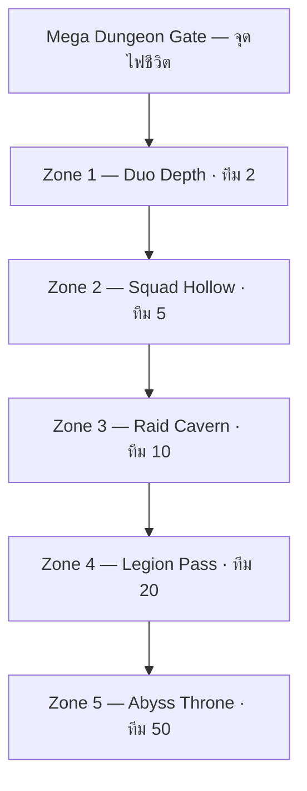

# หุบเขามรณะ — Mega Dungeon (Hellbound)

**Version:** 0.1 · **Date:** 8 มิถุนายน 2026  
**Scope:** ดันเจี้ยนเดียวลึก 5 โซน · ทีม 2→5→10→20→50 · บทบาท · กุญแจ · ผลตอบแทน  
**Config:** `PrismDeathValleyDungeonConfig.luau` · `PrismDungeonConfig.luau`

---

## 1. แนวคิดหลัก

**หุบเขามรณะ** ไม่ใช่แค่ survival horror — เป็น **Mega Dungeon บนดาว Hellbound** ที่ลึกลงเรื่อยๆ ต้องการทีมใหญ่ขึ้นทุกชั้น

| หลักการ | รายละเอียด |
|---------|------------|
| โซนแรก | ทีม **2 คน** |
| โซนถัดไป | **5 → 10 → 20 → 50** คน (ลึกสุด) |
| Solo | เข้าโซน 2 ได้แต่ **ไม่รอด** (50% เปิดประตู · 75% ชนะ) |
| กุญแจ | **ทุกโซน · ทุกคน · 1 ดอก/โซน** ถ้าผ่านเงื่อนไข |
| ผลตอบแทน | **+10% ต่อโซน** สะสม (โซน 1 = 100% … โซน 5 = 140%) |
| Loadout | น้ำหนักจำกัด · Medic vs Heavy · Ammo · Grenade |

**เส้นทางเข้า:** Eternity City → Hellbound Terminal → Hyperspace → Colony → Rail → Base → Spirit Tunnel → **Mega Dungeon Gate**

---

## 2. แผนที่ 5 โซน (ลึก → ใหญ่)



| โซน | ID | ทีม | เข้าบอส 50% | ชนะ 75% | Reward Mult | Boss |
|-----|-----|-----|-------------|---------|-------------|------|
| 1 | `duo_depth` | 2 | 1 | 2 | **100%** | Wraith Pair |
| 2 | `squad_hollow` | 5 | 3 | 4 | **110%** | Hollow Choir |
| 3 | `raid_cavern` | 10 | 5 | 8 | **120%** | Spirit Colossus |
| 4 | `legion_pass` | 20 | 10 | 15 | **130%** | Legion Warden |
| 5 | `abyss_throne` | 50 | 25 | 38 | **140%** | **Triad Wraith Sovereign** |

สูตร reward: `baseReward × (1 + 0.10 × (zoneIndex - 1))`

---

## 3. กุญแจอัตโนมัติ — 1 ดอก/คน/โซน

### เงื่อนไขรับกุญแจ (ครบทุกข้อ)

1. **อยู่ครบ** ตั้งแต่เริ่มโซนจนจบโซน (ไม่ disconnect / ไม่ถูก kick AFK)
2. **มีบทบาท** ที่ลงทะเบียนตอนเข้าโซน และทำ **contribution ขั้นต่ำ**
3. **โซนจบสำเร็จ** (ทีมถึง 75% และ clear boss)

### Contribution ขั้นต่ำต่อบทบาท

| บทบาท | เงื่อนไข contribution |
|--------|----------------------|
| **Boss Striker** | โจมตีบอส · damage หรือ hit count ถึง threshold |
| **Add Striker** | โจมตีศัตรู/adds · threshold แยกจากบอส |
| **Combat Medic** | รักษาเพื่อน **≥ 5 ครั้ง** + ช่วยโจมตี **≥ 3 ครั้ง** |
| **Ammo Runner** | ส่งกระสุนให้เพื่อน **≥ 5 ครั้ง** + ช่วยโจมตี **≥ 3 ครั้ง** |
| **Grenadier / Trapper** | ใช้ grenade/trap **≥ 5 ครั้ง** ที่โดนเป้าหมาย + ช่วยโจมตี **≥ 3 ครั้ง** |
| **Heavy Gunner** | โจมตีด้วยอาวุธหนัก · threshold สูง · **ต้องมี Ammo Runner ในทีม** |

> UI แสดง progress bar ต่อบทบาท · ไม่ถึง threshold = ไม่ได้กุญแจแม้โซนผ่าน

---

## 4. ระบบ Loadout — น้ำหนัก & ชุดปฐมพยาบาล

### 4.1 น้ำหนักรวม (Weight Cap)

ทุกคนมี **Weight Cap** เท่ากัน (เช่น 50 หน่วย) — ของทุชิน + อาวุธ + กระสุน + ยา + ระเบิด

| ประเภท | น้ำหนักต่อชิ้น (ตัวอย่าง) |
|--------|---------------------------|
| ชุดปฐมพยาบาลทีม (supply) | 1 หน่วย/ชิ้น · **สูงสุด 50 = เต็ม** |
| ชุดปฐมพยาบาลส่วนตัว (personal kit) | 1 หน่วย/ชุด (ใช้ซ้ำได้) |
| อาวุธเบา | 8–12 |
| อาวุธหนัก | 25–35 |
| กระสุบ heavy mag | 2–4 |
| Grenade / Trap | 3–6 |

### 4.2 Combat Medic (ชุดปฐมพยาบาลทีม)

| ฟิลด์ | ค่า |
|-------|-----|
| ซื้อได้ | สูงสุด **50 ชิ้น** (= น้ำหนักเต็มถ้าแบกอย่างเดียว) |
| อาวุธ | **เบาเท่านั้น** (Heavy Gunner ห้ามใช้ loadout นี้) |
| การรักษา | **คลิกเลือกเพื่อน** → กดปุ่ม Heal → **channel 3 วินาที** |
| ผลรักษา | **Slow 80%** ให้เป้าหมาย (debuff ศัตรู/บอส ช้าลง 80% ช่วงสั้น — cosmetic PvE) |
| บทบาท | Combat Medic |

### 4.3 Personal Medic Kit (ส่วนตัว — ทุกคนซื้อได้)

| ฟิลด์ | ค่า |
|-------|-----|
| น้ำหนัก | **เท่ากับ supply 1 หน่วย** ต่อชุด |
| Channel | **9 วินาที** |
| ผลรักษา | **Slow 50%** |
| จำกัด | ใช้ร่วมกับ Heavy ได้ · แต่ไม่แทน Combat Medic ใน raid ใหญ่ |

### 4.4 Heavy Gunner

- **เฉพาะผู้ที่ไม่ใช่ Combat Medic loadout**
- แบกอาวุธหนักได้
- **ต้องมี Ammo Runner** ในทีม (raid10+) — UI เตือนถ้าไม่มี

### 4.5 Ammo Runner

- แบกกระสุนสำหรับ Heavy Gunners
- ส่งกระสุน: เป้าเพื่อน + ปุ่ม Transfer Ammo (range สั้น)

### 4.6 Grenadier / Trapper

- Grenade: damage ส่วนตัว / วงกว้าง
- Trap: ชะลอ / root สั้น / DoT วิญญาณ
- จำเป็นสำหรับ boss ที่มี enrage timer (โซน 3+)

---

## 5. Flow การรักษา (UX)

```
1. เลือบทบาท Combat Medic หรือถือ Personal Kit
2. คลิก/lock-on เป้าหมายเป็น teammate
3. กด Heal → channel bar (3s team / 9s personal)
4. สำเร็จ → apply Slow debuff % + heal cosmetic HP bar
5. นับ contribution สำหรับกุญแจ
```

**ห้าม** heal ตัวเองนับ contribution เกิน 20% ของ quota (กัน solo medic)

---

## 6. โซน 5 (50 คน) — องค์ประกอบทีมแนะนำ

| บทบาท | จำนวนแนะนำ (50 คน) |
|--------|---------------------|
| Combat Medic | 6–8 |
| Heavy Gunner | 10–12 |
| Ammo Runner | 8–10 |
| Grenadier / Trapper | 6–8 |
| Boss Striker | 10+ |
| Add Striker | ที่เหลือ |

---

## 7. ความสัมพันธ์กับ Hellbound Travel

| ชั้นก่อน dungeon | เนื้อหา |
|------------------|---------|
| Peak Colony | ซื้อ loadout · ลงทะเบียนบทบาท |
| Military Base | Briefing · LFG board 50 |
| Spirit Tunnel 3 ห้อง | Warm-up co-op · ไม่ให้กุญแจ mega dungeon |
| Mega Dungeon Gate | เริ่ม Zone 1 (duo) |

---

## 8. Anti-abuse

- AFK > 60s ไม่นับ contribution
- Disconnect = ไม่ได้กุญแจโซนนั้น
- ส่งกระสุน/รักษา spam ตัวเอง = ไม่นับ
- GriefingGuard: heal enemy / drop trap on ally = strike

---

## 9. Code

```
PrismDeathValleyDungeonConfig.luau  — zones, roles, weight, key rules
PrismDungeonConfig.luau             — mega dungeon id dv_mega_abyss
GameConfig.DeathValley.MegaDungeon  — enable flag
DungeonContributionChecker.luau     — role threshold checks
PrismKeyService.luau                — grant zone keys → PrismKeyCount
```

---

## 10. Studio Test (MVP Zone 1)

1. `GameConfig.StudioDev.SimulatePlaceKey = "DeathValley"` (default) — Play in Studio
2. Walk to **Loadout Kiosk** (east of sanctuary, x≈140) → **Open Loadout** → Lock
3. **Zone 1 Gate** → Enter zone
4. **Boss Arena** → Start (need 2 players for win; 1 player = low survival message)
5. **E** = heal ally · **F** = attack boss (15 dmg/hit · 240 HP)
6. ชนะ + contribution ครบ → **Prism Key +1** (`PrismKeyCount` attribute · 1 ครั้ง/โซน/คน)

**Contribution Zone 1:** Boss Striker 8 hits · Add Striker 6 hits · Combat Medic 5 heals + 3 assists · Personal Medic 3 heals + 2 assists

**Files:** `DeathValleyZone1Builder` · `DungeonLoadoutUI` · `DungeonZone1HUD` · `Dungeon/*Service*` · `PrismKeyService` · `DungeonContributionChecker`
