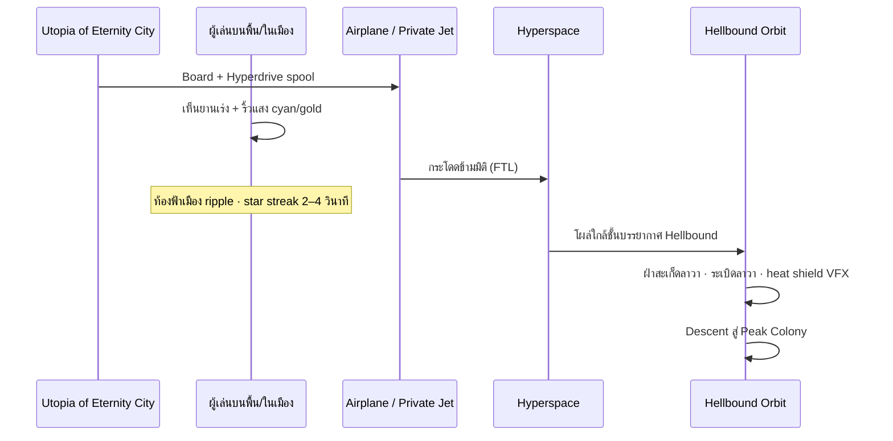

# Hellbound — ดาวเคราะห์ & เส้นทางสู่หุบเขามรณะ

**Version:** 0.1 · **Date:** 8 มิถุนายน 2026  
**Scope:** Lore · Travel pipeline · Colony · Spirit Tunnel · Place 5 zones  
**Config:** `PrismHellboundConfig.luau` · `GameConfig.Hellbound`

---

## 1. ดาวเคราะห์ Hellbound (มุ่งหน้าสู่ขุมนรก)

| ฟิลด์ | รายละเอียด |
|-------|------------|
| ชื่อ | **Hellbound** — แปลว่า *มุ่งหน้าสู่ขุมนรก* |
| สภาพพื้นผิว | ภูเขาไฟปะทุทั่วดาว · ลาวาพุ่งสูงถึงชั้นบรรยากาศ |
| การเดินบนพื้นผิว | **มนุษย์เดินไม่ได้** — อุณหภูมิ/ลาวา/เถ้าถ่น |
| สิ่งมีชีวิตเดิม | สูญพันธุ์หมดแล้ว — **คงเหลือวิญญาณ (Shadow Wraiths)** |
| อาณานิคมมนุษย์ | ยอดภูเขาใหญ่ — ลานกว้าง + สถานีขนส่ง + เมืองโดม |

---

## 2. จุดออกเดินทาง — Utopia of Eternity City

ผู้เล่นต้องไปที่ **Hellbound Interstellar Terminal** ในเมือง flagship (Marina / Sky district)

| ยาน | ประเภท | หมายเหตุ |
|-----|--------|----------|
| **Public Transport Airplane** | ขนส่งสาธารณะ | ตามตาราง · ราคา Utopia currency / ticket |
| **Private Jet** | ส่วนตัว | Robux / Game Pass · ขึ้นทันที |

ทั้งสองติด **Hyperdrive Engine (ไฮเปอร์ไดรฟ์)**

---

## 3. Hyperspace Jump — ที่ผู้เล่นในเมืองเห็นได้



### Phase รายละเอียด (Gameplay)

| Phase | ID | รายละเอียด | ผู้เล่นที่อยู่เมือง |
|-------|-----|------------|---------------------|
| 1 | `Boarding` | ขึ้นเครื่องที่ Terminal | — |
| 2 | `HyperspaceSpool` | 3–5 วิ · เสียง bass · UI warp | **เห็นยานพุ่งขึ้น + ริ้วแสง** |
| 3 | `HyperspaceTransit` | 8–15 วิ · star tunnel | ยานหายจาก map · ท้องฟ้า ripple |
| 4 | `HellboundAtmosphere` | โผล่ orbit · ลาวา debris | — |
| 5 | `LavaDescent` | ฝ่าระเบิด · shield flash | — |
| 6 | `PeakColonyDock` | จอดสถานียอดเขา | — |

**Spectator sync:** Client ใน `EternityCity` subscribe event `HellboundJumpSpectator` — แสดง silhouette ยาน + hyperspace streak บนท้องฟ้า (ไม่ต้องอยู่ในเครื่อง)

---

## 4. Peak Colony — อาณานิคมมนุษย์บนยอดเขา

| โซน | รายละเอียด |
|-----|------------|
| **Summit Plateau** | ลานกว้างมาก — landing pad ยานอวกาศ/เครื่องบิน |
| **Transport Hub** | แลกตั๋ว · รอ shuttle · codex lore Hellbound |
| **Colony Dome** | **Barrier Dome โค้ง** คลุมเมืองเล็ก — กันลาวา/เถ้า/วิญญาณ |
| **Sanctuary variant** | จุดพักปลอดภัยภายในโดม — ไม่มี Wraith ในโดม |

### ลำดับการเคลื่อนที่หลังจอด

```
Peak Colony Dock
    → Elevator (ชั้นบน → ชั้นใต้ดิน)
    → High-Speed Rail Platform
    → HST ลอดอุโมงค์ยาว (cinematic / loading)
    → Underground Rail Station (ใกล้ปลายอุโมงค์)
    → Military Research Base (ฐานทัพใต้ภูเขา)
    → Tunnel Exit (ทหารสร้าง)
    → Spirit Lock Tunnel (3 ห้อง)
    → หุบเขามรณะ (Death Valley gameplay)
```

---

## 5. ฐานทัพวิจัยทางทหาร (Undermountain Base)

| องค์ประกอบ | รายละเอียด |
|------------|------------|
| ตำแหน่ง | ใต้ภูเขาใหญ่ · ปลายอุโมงค์รถไฟ |
| หน้าที่ | วิจัยวิญญาณ · ควบคุมอุโมงค์ · ป้องกัน colony |
| ทางออก | **Military Tunnel** — ไปยังหุบเขามรณะ |
| NPC | วิศวกรทหาร · หน่วยรบพิเศษ · ผู้ควบคุม rail |

---

## 6. Spirit Lock Tunnel — อุโมงค์ 3 ห้อง

> **กฎ:** ไม่มีพาหนะ — **เดินเท่านั้น** · วัสดุพิเศษกันอนุภาควิญญาณ

### โครงสร้าง

```
[ Military Base Exit ]
        │
   ┌────┴────┐
   │ Chamber │  1 — Entry Lock
   │    1    │
   └────┬────┘
        │ (airlock door)
   ┌────┴────┐
   │ Chamber │  2 — Mid Lock
   │    2    │
   └────┬────┘
        │
   ┌────┴────┐
   │ Chamber │  3 — Final Lock
   │    3    │
   └────┬────┘
        │
 [ หุบเขามรณะ — จุดไฟชีวิต ]
```

### แต่ละห้อง — ระบบป้องกัน

| ชั้น | รายละเอียด |
|------|------------|
| **ผนังชั้น 1** | โลหะ-เซรามิก Hellbound alloy · ทนความร้อน |
| **ผนังชั้น 2 (ฝัง)** | **Control Room** — กระจกกันกระสุน + กันวิญญาณ · **ทำลายไม่ได้** |
| **พื้นห้อง** | หุ่นยนต์ยาม (ground turret bots) · ปืนกล · **ปืนยิงอนุภาพ (particle)** |
| **ผนัง** | ปืนแบบใช้กระสุน + ปืนยิงอนุภาพ · คอมพิวเตอร์ + ทหารควบคุม |
| **บุคลากร** | วิศวกร + หน่วยรบพิเศษ เฝ้าใน control room ชั้น 2 |

### Gameplay ในอุโมงค์

| กลไก | รายละเอียด |
|------|------------|
| Spirit breach | Wraith พยายามแทรกซึม — ปืนอนุภาพ + bot ยิงอัตโนมัติ |
| Player role | ร่วมทีมเดิน · ซ่อม relay · เปิด airlock ร่วมกัน (co-op) |
| Solo | **เข้าได้** แต่ overwhelm — สอนให้หาเพื่อนก่อนเข้า หุบเขามรณะ |
| Vehicle | **ห้าม** — dismount ก่อน airlock |

---

## 7. หุบเขามรณะ — เมืองวิญญาณ (Place 5)

หลังผ่าน 3 ห้อง → เข้า **Death Valley** gameplay เดิม:

- Eternal night · Light Beacon · Night Survived
- Shadow Wraiths · co-op 4 · Luminite Shard
- POI: Whispering Grove, Hollow Lake, Veilwood Spire ฯลฯ

**Lore:** หุบเขานี้คือเมืองของสิ่งมีชีวิตดาว Hellbound ที่ตายหมดแล้ว — เหลือวิญญาณโกรกแกร่ง

---

## 8. ความสัมพันธ์กับ Hub Veilwood Gate

| ทาง | สถานะ |
|-----|--------|
| **Canonical** | Eternity City → Hellbound Terminal → Hyperspace → Colony → Rail → Base → 3 Chambers → หุบเขามรณะ |
| **Hub Gate** | **Exit-only shortcut** กลับ Hub · หรือ tutorial skip (maturity + warning) — **ไม่ใช่เส้นทางหลัก** |

---

## 9. Place / Zone Map (Implementation)

| Zone ID | Place | Build status |
|---------|-------|--------------|
| `HellboundTerminal` | EternityCity | Greybox stub — Marina airfield |
| `HyperspaceInstance` | Shared cinematic | Reuse Shuttle heaven pipeline |
| `PeakColony` | DeathValley (subzone) | Planned |
| `UndermountainRail` | DeathValley (subzone) | Planned |
| `MilitaryBase` | DeathValley (subzone) | Planned |
| `SpiritTunnel` | DeathValley (subzone) | Planned — 3 chambers |
| `DeathValleyCore` | DeathValley | Greybox MVP (beacon) |

---

## 10. IP & Tone

- ไม่ใช้ชื่อ franchise อื่น
- Hellbound = original Utopia lore
- Particle weapons = sci-fi aesthetic · **cosmetic damage to Wraiths only** ใน PvE
- ไม่มี gore สมจริง — วิญญาณเป็น particle entities

---

## 11. Code Reference

```
PrismHellboundConfig.luau   — phases, chambers, transport types
GameConfig.Hellbound        — planet name, terminal place key
DeathValleyWorldBuilder     — zone folders (greybox markers)
EternityCityWorldBuilder    — HellboundTerminal marker
ShuttleJourney.luau         — reuse hyperspace VFX patterns
```
