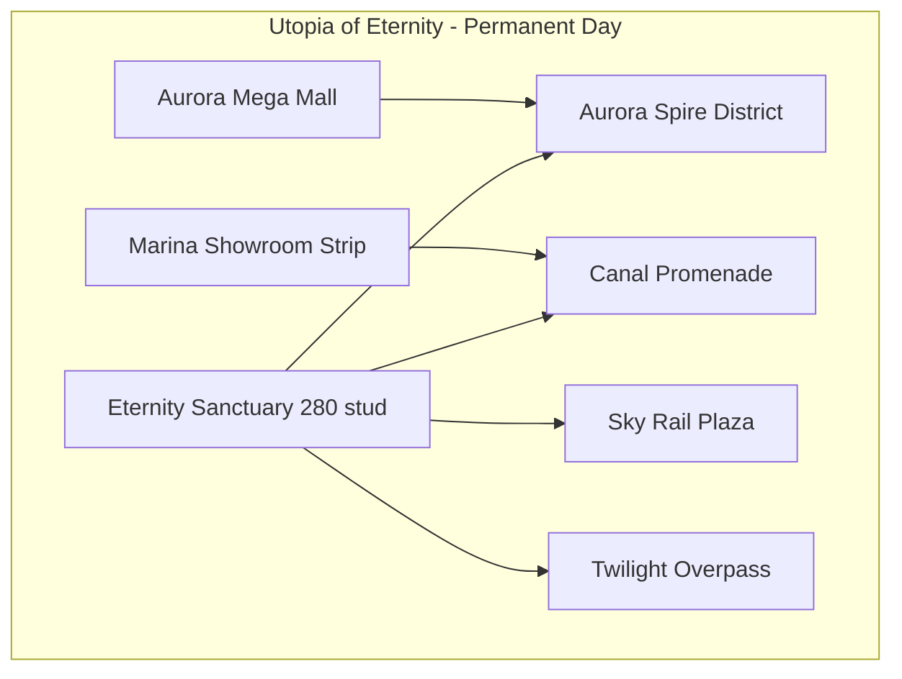

# City Encyclopedia — Utopia of Eternity Universe

**Version:** 0.1 · **Date:** 8 มิถุนายน 2026  
**Scope:** รายละเอียดทุกเมือง MVP (5 Places) + Phase 8 (3 Places)  
**Canonical names:** ใช้ชื่อจาก `GameConfig.luau` (Place 4 = **Utopia of Eternity**, Place 5 = **หุบเขามรณะ**)

---

## สารบัญ

1. [ภาพรวม Universe](#1-ภาพรวม-universe)
2. [Place 1 — Utopia Plaza Hub](#2-place-1--utopia-plaza-hub)
3. [Place 2 — Solhaven](#3-place-2--solhaven)
4. [Place 3 — Nocturne Alley](#4-place-3--nocturne-alley)
5. [Place 4 — Utopia of Eternity (Flagship)](#5-place-4--utopia-of-eternity-flagship)
6. [Place 5 — หุบเขามรณะ (Death Valley)](#6-place-5--หุบเขามรณะ-death-valley)
7. [Phase 8 — Citadel Arcane, Verdant Depths, Skyward Perch](#7-phase-8--citadel-arcane-verdant-depths-skyward-perch)
8. [ระบบข้ามเมือง](#8-ระบบข้ามเมือง)
9. [Prism Keys — ตำแหน่ง & รางวัล](#9-prism-keys--ตำแหน่ง--รางวัล)
10. [สถานะ Build & Code Map](#10-สถานะ-build--code-map)

---

## 1. ภาพรวม Universe

### One-liner

Hang out กลางวัน · ล่าปริศนาข้ามเมือง · horror กลางคืนถาวรเมื่อพร้อม

### ตารางเมืองทั้งหมด

| # | Place Key | ชื่อในเกม | เวลาในแมพ | ประเภท | Sanctuary |
|---|-----------|-----------|-----------|--------|-----------|
| 1 | `Hub` | Utopia Plaza Hub | กลางวันถาวร | Hub Social | Prism Heart Plaza (120 stud) |
| 2 | `Solhaven` | Solhaven | กลางวันถาวร | Explore + Trade + Garden | Sunhaven Sanctuary (120 stud) |
| 3 | `Nocturne` | Nocturne Alley | Twilight ถาวร | Ambience + Mystery | Twilight Meet Point (120 stud) |
| 4 | `EternityCity` | Utopia of Eternity | กลางวันถาวร | Solarpunk + Commerce flagship | Eternity Sanctuary (**280 stud**, 8+ spawn) |
| 5 | `DeathValley` | หุบเขามรณะ (**Hellbound**) | **กลางคืนถาวร 100%** | Horror · Hyperspace travel | จุดไฟชีวิต (120 stud) |
| 6 | — | Citadel Arcane | กลางวัน + crypt มืด | Fantasy MMORPG puzzle | TBD (Phase 8) |
| 7 | — | Verdant Depths | สว่างเข้า → มืดลึก | Dungeon + reward | TBD (Phase 8) |
| 8 | — | Skyward Perch | กลางวัน | Mount / flying exploration | TBD (Phase 8) |

### กฎโซน (บังคับ)

| ประเภท | กลางวัน | Horror / Wraith | ตัวอย่าง |
|--------|---------|-----------------|----------|
| Social / Explore | ถาวร | ไม่มี | Hub, Solhaven, Utopia of Eternity |
| Ambience | Twilight สวย | ไม่ใช่ survival | Nocturne Alley |
| Horror | **ห้ามมีกลางวัน** | กลางคืนถาวร | หุบเขามรณะ |

### Performance Budget (ต่อ Place)

| Metric | Mobile | PC |
|--------|--------|-----|
| Parts streamed in | < 8,000 | < 15,000 |
| StreamingTargetRadius | 512 stud | 768 stud |
| FPS | ≥ 30 | ≥ 60 |
| Join time | < 25 sec | < 15 sec |

*Utopia of Eternity (flagship): ground 1024 stud, MaxParts 16,000, StreamingTargetRadius 640*

---

## 2. Place 1 — Utopia Plaza Hub

### ข้อมูลพื้นฐาน

| ฟิลด์ | ค่า |
|-------|-----|
| Place Key | `Hub` |
| ชื่อแสดง | Utopia Plaza Hub |
| Subtitle | Central Plaza |
| Day Mode | `permanent_day` |
| Builder | `HubWorldBuilder.luau` |
| Theme | `organic_plaza` |
| Ground Size | 512 × 512 stud |
| Max Parts | 8,000 |

### บทบาทใน Universe

- **จุดเริ่มต้น** ของผู้เล่นทุกคน — spawn, onboarding, tutorial Prism Key #1
- **ศูนย์กลางเทเลพอร์ต** ไป 4 เมือง MVP
- **Museum & Codex** — แสดง Luminlings, lore, progress ปริศนา
- **ประตู horror opt-in** — Veilwood Gate → หุบเขามรณะ (คำเตือน + maturity)
- **Prism Hover Shuttle** — จุดจอดแรกใน route ข้ามเมือง

### Sanctuary — Prism Heart Plaza

| องค์ประกอบ | รายละเอียด |
|------------|------------|
| รัศมี | **120 stud** |
| Spawn | `SanctuarySpawn` กลางจัตุรัส |
| Mount Pad | ขึ้น-ลงพาหนะบิน (ยูนิคอร์น ฯลฯ) ได้ที่นี่เท่านั้น |
| Safe Zone | ห้าม PvP · ห้าม Wraith |
| Social | Emote zone, ม้านั่ง, น้ำพุ, organic canopy |
| Transit Stop | Prism Hover Shuttle (20 ที่นั่ง, ออกทุก 15 นาที) |
| สิ่งอำนวยความ | Museum dome, teleport kiosks, garden arch, dance floor |

### โซน & POI

| โซน | POI / กิจกรรม | สิ่งที่ซ่อน / Meta |
|-----|---------------|-------------------|
| **Central Fountain** | น้ำพุกลาง, social hangout | **Prism Key #1** ใต้น้ำพุ (tutorial fixed) |
| **Museum Gallery** | โดมทอง (`MuseumDome`), showcase Luminlings | Codex entry, lore pages |
| **Garden Gate** | ซุ้มเขียว (`GardenArch`) | Prism Seed rare |
| **Teleport Arches / Kiosks** | 4 kiosk วงแหวนรัศมี 70 stud: Solhaven, Nocturne, EternityCity, DeathValley | ProximityPrompt → `PlaceTeleport` |
| **Veilwood Gate** | ประตูสีม่วงเข้ม → Place 5 | คำเตือน horror + maturity ก่อน teleport |
| **Hub Sign** | ป้าย Neon ชื่อเกม | — |
| **Prism Transit** | Shuttle greybox ที่ Sanctuary | Route leg 1 |

### Greybox ที่สร้างแล้ว (MVP)

- พื้น Slate 512 stud
- Sanctuary ellipse Neon cyan (MicroCurve)
- Organic canopy + sanctuary disc
- Museum dome ทอง (radius 18) ที่ (-60, 10, -40)
- Garden arch + ArchRibKit ที่ (55, 0, -35)
- Teleport kiosks 4 ทิศ (สีตามเมืองปลายทาง)
- Shuttle ที่ Sanctuary

### กิจกรรมหลัก

- Onboarding + Guide NPC (เปิด/ปิดได้)
- ปุ่ม **"เล่นกับเพื่อน"** → private shard / follow friend
- Seasonal: คริสต์มาส (ไฟประดับ), ลอยกระทง (river event ร่วมกับ flagship)
- Luminling Museum showcase
- เริ่มต้น Prism Keys mystery chain

### ไม่มีใน Hub

- Horror / Wraith / Beacon survival
- Commerce Peace Zone ขนาดใหญ่ (ร้านหลักอยู่ที่ Utopia of Eternity)
- Ground mount ใน Sanctuary

---

## 3. Place 2 — Solhaven

### ข้อมูลพื้นฐาน

| ฟิลด์ | ค่า |
|-------|-----|
| Place Key | `Solhaven` |
| Day Mode | `permanent_day` |
| Builder | `SolhavenWorldBuilder.luau` |
| Theme | `garden_terraces` |
| Ground Size | 480 stud |
| สไตล์ | สวนดอกไม้, แสงอุ่น, ชายหาด, treasure hunt |

### บทบาท

- **Garden grow** — Luminling / plot 3 ระดับ visual
- **Trade post** — แลกเปลี่ยน (EconomyInflationGuard)
- **Treasure hunt** — หีบสมบัติ, ถ้ำชายหาด
- **ไม่มี horror** — Forest Trail ไป Hub ปลอด Wraith

### Sanctuary — Sunhaven Sanctuary

| องค์ประกอบ | รายละเอียด |
|------------|------------|
| รัศมี | 120 stud |
| Spawn | 3 จุด (`SanctuarySpawn_1..3`) วงรอบ |
| ธีม | สวนดอกไม้ + แสงอุ่น + organic canopy |
| สิ่งอำนวยความ | Trade post, garden gate, transit stop |

### โซน & POI (Design)

| โซน | POI | สิ่งที่ซ่อน |
|-----|-----|------------|
| **Sun Market** | ตลาดใต้เสาโบสถ์ | หีบสมบัติ |
| **Coral Beach** | ชายหาด + ถ้ำ | **Prism Key #3** ในถ้ำ |
| **Forest Trail** | ทางเชื่อม Hub | ไม่มี Wraith |
| **Lighthouse** | หอคอย + cipher puzzle | **Prism Key #5**, cipher clue |
| **Garden Terraces** | 3 dome stages (greybox) | Luminling growth stages |

### Greybox ที่สร้างแล้ว

- พื้น Grass 480 stud
- Sanctuary 120 stud + 3 spawns + canopy
- **Garden Stage 1–3** — domes ที่ y=6/12/18, z=65/90/115, radius ลดตาม stage
- Gold neon rings รอบแต่ละ stage
- **Curved canal** — arc แก้ว cyan จาก x=-80 ถึง 80
- ArchRibKit ที่ (0, 0, -50)

### Seasonal

- **สงกรานต์ (เม.ย.)** — Water emote zone, Lotus Splash set pop-up

### Mount / Vehicle

- Ground mount: **Outskirts** เท่านั้น
- Flying mount: Sanctuary Mount Pad
- Shuttle: จุดที่ 2 ใน route

---

## 4. Place 3 — Nocturne Alley

### ข้อมูลพื้นฐาน

| ฟิลด์ | ค่า |
|-------|-----|
| Place Key | `Nocturne` |
| Day Mode | `permanent_twilight` (ClockTime 18.5) |
| Builder | `NocturneWorldBuilder.luau` |
| Theme | `twilight_arches` |
| Ground Size | 400 stud |
| สไตล์ | Neon อ่อน, jazz, Sherlock mystery — **ไม่ใช่ horror** |

### บทบาท

- **Sherlock-style clues** — graffiti = map fragment
- **Cipher puzzles** — นาฬิกา 3:33
- **Night Market ambience** — twilight สวย ไม่มี Wraith
- Clue รวมข้ามเมืองสำหรับ Prism Keys

### Sanctuary — Twilight Meet Point

| องค์ประกอบ | รายละเอียด |
|------------|------------|
| รัศมี | 120 stud |
| Spawn | 3 จุด |
| ธีม | Neon อ่อน + jazz stage เล็ก + meet ring |
| สิ่งอำนวยความ | Clue board, cipher kiosk |

### Lighting (ถาวร)

| พารามิเตอร์ | ค่า |
|------------|-----|
| ClockTime | 18.5 |
| Brightness | 1.4 |
| Ambient | RGB(40, 30, 60) |
| Sky | Twilight slate `#0A1628` tone |

### โซน & POI (Design)

| โซน | POI | สิ่งที่ซ่อน |
|-----|-----|------------|
| **Neon Bazaar** | ตลาดกราฟฟิตี | Graffiti = map fragment |
| **Jazz Lounge** | ฉากดนตรี | **Prism Key #4** หลังฉาก |
| **Clock Tower** | หอนาฬิกา | Cipher **3:33** |
| **Mystery Alley** | 5 arches (`AlleyArch_1..5`) | Sherlock clues — **ไม่มี Wraith** |
| **Twilight Meet Ring** | วง Neon รัศมี 35 stud | Social meet point |

### Greybox ที่สร้างแล้ว

- พื้น Slate twilight 400 stud
- 5 alley arches + ArchRibKit แต่ละซุ้ม
- Meet ring neon cyan
- Sanctuary + 3 spawns + canopy

### ไม่มีใน Nocturne

- Shadow Wraiths
- Beacon / survival mechanics
- กลางวัน (ไม่เปลี่ยนเป็น day)

---

## 5. Place 4 — Utopia of Eternity (Flagship)

> ชื่อโค้ด: `EternityCity` · ชื่อแสดง: **Utopia of Eternity** · Subtitle: *The Eternal City*  
> แผนเดิมเรียก "Neo Prism" — ใช้ชื่อใหม่ในเกม

### ข้อมูลพื้นฐาน

| ฟิลด์ | ค่า |
|-------|-----|
| Place Key | `EternityCity` |
| Day Mode | `permanent_day` (solarpunk) |
| Builder | `EternityCityWorldBuilder.luau` + `CommerceDistrictBuilder.luau` |
| Theme | `solarpunk_flagship` |
| Ground Size | **1024 stud** (ใหญ่ที่สุดใน MVP) |
| Max Parts | 16,000 |
| Voxel | 0.1 stud (ละเอียดสุด) |

### Visual Bible — Prism Solarpunk

| องค์ประกอบ | รายละเอียด |
|------------|------------|
| สถาปัตยกรรม | Organic curve, rib ทอง, กระจกโค้ง, หอเข็ม |
| สีหลัก | Pearl `#F5F5F0` · Gold `#D4AF37` · Cyan `#00E5FF` |
| ธรรมชาติ | ทะเล + ชายหาด + แม่น้ำล้อมเมือง + vertical garden |
| แสง | สว่างอบอุ่น, neon accent ~30%, **ไม่มี Wraith** |
| Geography | Sand coast ทิศตะวันออก, น้ำลำน้ำกลางเมือง |

### บทบาท

- **Commerce flagship** — แฟชั่น, ยานพาหนะ, mount, อาวุธ cosmetic, beauty
- **Photo / UGC marketing** — selfie spots, photo mode, emote stage
- **Vertical transport** — monorail, elevator, sky bridge
- **Prism Key gates** — ปลดโซนตามจำนวนกุญแจ (11, 15, 20)
- **Face creation** — Template Forge + Prism Live Mirror (key 25)

### Sanctuary — Eternity Sanctuary

| องค์ประกอบ | รายละเอียด |
|------------|------------|
| รัศมี | **280 stud** (ใหญ่สุดใน universe) |
| Spawn | **8+ จุด** กระจายรอบวง |
| ธีม | พื้นกระจก grid cyan, organic canopy, pearl disc |
| สิ่งอำนวยความ | Monorail hub, photo booth, fashion preview, transit stop |

### ระบบปลดล็อกโซน (Prism Keys)

| กุญแจสะสม | โซนที่เข้าได้ | หมายเหตุ |
|-----------|--------------|----------|
| 0–9 | **Preview Tour** — เฉพาะ Eternity Sanctuary 280 stud | ยังไม่เดินเมืองเต็ม |
| 10+ | Free Roam Partial | จบ Preview Tour + mount choice ครั้งที่ 3 |
| 11+ | **Canal Promenade** | Gate key #11 วางในเมือง |
| 15+ | **Sky Rail Plaza** + Premium Shop + รถ 4 แบบ | Gate key #15 |
| 20+ | **Full City** + Sky Lounge ชั้น 50 + อาวุธ Legendary ฟรี 1 ชิ้น | Gate key #20 |
| 25 | **Prism Live Mirror** kiosk | Face live camera (PDPA) |

> **Code contract:** กุญแจดอก 1–10 **ห้ามซ่อนในเมืองนี้** — ต้องไปเมืองอื่น  
> กุญแจ gate ในเมือง: **11, 15, 20** เท่านั้น

### Districts — โครงสร้างเมือง



#### Aurora Spire District

| รายการ | รายละเอียด |
|--------|------------|
| จุดเด่น | **Prism Tower** spire สูง 120 stud, Aurora Dome, glass band cyan |
| กิจกรรม | สำรวจหอ, ลิฟต์ (design: 20 ชั้นแรกเปิด) |
| POI design | กุญแจ #7 ชั้น 47 (แผนเดิม — ย้ายออกจากเมืองตาม code contract ได้) |
| Greybox | `AuroraSpireDistrict` folder, ArchRibKit x18 |

#### Canal Promenade

| รายการ | รายละเอียด |
|--------|------------|
| จุดเด่น | น้ำแก้ว 400×40 stud, boardwalk โค้ง + neon trim |
| กิจกรรม | เรือ cosmetic (Canal Cruiser), fashion stroll |
| ร้าน | Accessory Lane, Luminling Pet Clinic |
| ปลดล็อก | Prism Key **11+** |
| POI design | Rare mask drop |

#### Sky Rail Plaza

| รายการ | รายละเอียด |
|--------|------------|
| จุดเด่น | Monorail track โค้งสูง ~25–33 stud, gold neon rail |
| กิจกรรม | Monorail tour (server-side tween), mount showroom |
| ร้าน | Mount Emporium, Stable Care, Weapon Gallery, Seasonal Pop-Up, Sky Vet |
| Shuttle | จอดที่ district นี้ |
| ปลดล็อก | Prism Key **15+** |
| POI design | Blueprint mount part |

#### Twilight Overpass

| รายการ | รายละเอียด |
|--------|------------|
| จุดเด่น | Event arch ใหญ่ + neon ring — แสงเย็น **event เท่านั้น** |
| กิจกรรม | Photo mode, emote stage, seasonal light show |
| ร้าน | Photo Mode Boutique, Emote Stage Shop |
| หมายเหตุ | **ไม่มี Wraith** — ambience ไม่ใช่ horror |

#### Aurora Mega Mall (Commerce)

| รายการ | รายละเอียด |
|--------|------------|
| อาคาร | MegaMallTower spire 90 stud, 5 floor bands |
| ร้าน (greybox) | Prism Wardrobe, World Culture Pavilion, Stellar Salon, Prism Beauty, Eternity Aesthetics |
| Sky Lounge | ชั้น 50 marker — **RequiresKey 20** |
| Live Mirror | Kiosk แก้ว cyan — **RequiresKey 25**, `FaceMode = PrismLiveMirror` |

#### Marina Showroom Strip

| รายการ | รายละเอียด |
|--------|------------|
| ตำแหน่ง | Pier 120 stud ที่ x≈220 |
| ร้าน | Prism Motors, Prism Service Center (premium paint 499–999 R$), Neon Alley Tune (budget 99–249 R$) |

### ร้านค้าทั้งหมด (19 แห่ง)

**Luxury Mall (ในอาคาร — 3× Robux · ไม่ต้องมีกุญแจ):** Eternity Luxury Galleria, Prism Wardrobe, World Culture, Salon, Beauty, Aesthetics

**Street (ข้างนอก — 1× · ต้อง Prism Keys):** ร้าน Canal / Marina / Sky Rail / Twilight ทั้งหมด

**Hellbound Terminal:** Public Airplane + Private Jet → Hyperspace → ดาว Hellbound

ทุกร้านอยู่ใน **Commerce Peace Zone**

| ID | ชื่อ | District | บริการ |
|----|------|----------|--------|
| `prism_wardrobe` | Prism Wardrobe | Aurora Mega Mall F3 | เสื้อ, รองเท้า, หมวก, bundles + Teen Trend 30 ชุด |
| `world_culture_pavilion` | World Culture Pavilion | Aurora Mega Mall F15 | ชุดประจำชาติ 20 ประเทศ × 2 = 40 ชุด |
| `stellar_salon` | Stellar Salon | Aurora Mega Mall F23 | ผม, extension, ย้อม |
| `prism_beauty` | Prism Beauty Studio | Aurora Mega Mall F22 | ผิว, makeup |
| `eternity_aesthetics` | Eternity Aesthetics Clinic | Aurora Mega Mall F22 | face morph preset |
| `accessory_lane` | Accessory & Jewelry Lane | Canal Boutique Row | คอ, ข้อมือ, หน้า, หลัง |
| `luminling_clinic` | Luminling Pet Clinic | Canal Boutique Row | heal, pet accessory |
| `seasonal_pop_up` | Seasonal Pop-Up | Sky Rail Plaza | ชุด 6 เทศกาล |
| `mount_emporium` | Mount Emporium | Sky Rail Plaza | ซื้อ mount |
| `stable_care` | Stable Care | Sky Rail Plaza | grooming, อาหาร cosmetic, nameplate |
| `sky_vet` | Sky Vet Wing | Sky Rail Plaza | mount heal cosmetic |
| `weapon_gallery` | Prism Weapon Gallery | Sky Rail Plaza | weapon skin (ปลด shop key 15) |
| `prism_motors` | Prism Motors Showroom | Marina | ซื้อรถ |
| `prism_service_center` | Prism Service Center | Marina | premium paint, underglow |
| `neon_alley_tune` | Neon Alley Tune Shop | Marina | budget paint, stickers |
| `photo_boutique` | Photo Mode Boutique | Twilight Overpass | filter, frame, watermark |
| `emote_stage_shop` | Emote Stage Shop | Twilight Overpass | emote, dance prop |

### แคตตาล็อกแฟชั่น (สรุป)

| หมวด | จำนวน | Module |
|------|-------|--------|
| Signature | 6 ชุด | `PrismFashionCatalog` |
| Seasonal | 6 เทศกาล | `PrismFashionCatalog` |
| National | 40 ชุด (20 ประเทศ) | `NationalFashionSets.luau` |
| Teen Trend | 30 ชุด | `TeenTrendFashionSets.luau` |
| **รวม** | **82 ชุด** | Deploy gate: 500+ ไอเทมปี 1 |

### POI เพิ่มเติม (Design — ยังไม่ greybox ครบ)

| POI | กิจกรรม | สิ่งที่ซ่อน |
|-----|---------|------------|
| Circuit Plaza | Tutorial, Template Forge | (แผนเดิม key #2) |
| Hologram Bazaar | 30 ร้าน | Pet egg |
| Data Vault -1F | Cipher puzzle | Key #12 |
| Rooftop Garden | Prism Seed plot | Luminling rare |
| Hover Showroom | Mount skins | Vehicle skin unlock |

### Vehicle Skins (cosmetic)

| ชื่อ | ใช้ได้ที่ |
|------|-----------|
| Prism Glide | Outskirts + Golden Arch |
| Canal Cruiser | Canal Promenade เท่านั้น |
| Sky Pod | Skyward Perch (Phase 8) |
| Monorail Pass | Fast travel — ไม่ใช่ mount |

### Seasonal Events ในเมืองนี้

| Event | กิจกรรม |
|-------|---------|
| ปีใหม่ | Fireworks |
| ตรุษจีน | Lantern Redream pop-up |
| ลอยกระทง | River + krathong emote |
| คริสต์มาส | Aurora Noel |
| ฮัลโลวีน | Prism Phantom (cute horror cosmetic) |

### Security (verticality สูง)

| ภัยคุกคาม | การป้องกัน |
|-----------|------------|
| Fly hack ข้าม Tower | MovementValidator + height cap |
| Noclip กระจก | Collision ทุก MeshPart |
| Teleport Data Vault | RemoteGuard server-side |
| Monorail hijack | Server tween path |

---

## 6. Place 5 — หุบเขามรณะ (Death Valley) · ดาวเคราะห์ **Hellbound**

> Place Key: `DeathValley` · Planet: **Hellbound** (มุ่งหน้าสู่ขุมนรก)  
> **Full travel spec:** `docs/HELLBOUND-TRAVEL-AND-DEATH-VALLEY.md`

### ข้อมูลพื้นฐาน

| ฟิลด์ | ค่า |
|-------|-----|
| Planet | **Hellbound** — ภูเขาไฟทั่วดาว · ลาวาพุ่งถึงชั้นบรรยากาศ · **เดินพื้นผิวไม่ได้** |
| Day Mode | `eternal_night` — **ห้ามกลางวัน** |
| Builder | `DeathValleyWorldBuilder.luau` |
| Theme | `cave_beacon` + Hellbound colony pipeline |
| Ground Size | 400 stud (core) + subzones |
| ClockTime | **ล็อก 0** server-side |
| Sky | `#0A1628` — ไม่มี sun |

### บทบาท

- **Horror survival opt-in** บนดาว Hellbound
- เมืองวิญญาณ — สิ่งมีชีวิตดาวนี้ตายหมดแล้ว เหลือ **Shadow Wraiths**
- Co-op 4 คน, Night Survived, Light Beacon
- **Spirit Lock Tunnel** — 3 ห้อง · เดินเท่านั้น · หุ่นยนต์+ปืนอนุภาพ

### ทางเข้า (Canonical)

```
Utopia of Eternity → Hellbound Interstellar Terminal
  → Public Airplane หรือ Private Jet (Hyperdrive)
  → Hyperspace (ผู้เล่นในเมืองเห็นการกระโดดข้ามมิติ)
  → โผล่ชั้นบรรยากาศ Hellbound · ฝ่าลาวา/สะเก็ด
  → Peak Colony (โดม barrier บนยอดเขา)
  → ลิฟต์ → รถไฟความเร็วสูงใต้ดิน
  → Military Research Base → Spirit Tunnel 3 ห้อง
  → หุบเขามรณะ (จุดไฟชีวิต)
```

Hub Veilwood Gate = **exit shortcut** กลับเท่านั้น (ไม่ใช่เส้นทางหลัก)

### Sanctuary — จุดไฟชีวิต

| องค์ประกอบ | รายละเอียด |
|------------|------------|
| รัศมี | 120 stud |
| Spawn | 3 จุด |
| ธีม | มืด แต่ safe — แสง Beacon amber วงเดียว |
| ห้าม | Wraith ใน radius Sanctuary |
| สิ่งอำนวยความ | Co-op queue, Beacon Lv1 craft |

### Eternal Night — ค่าคงที่

| พารามิเตอร์ | ค่า |
|------------|-----|
| Shadow spawn | 1–4 Wraiths / 100 stud |
| UI | Vignette + heartbeat (opt-out ได้) |
| Wave | เพิ่มทุก Night Survived |
| Progression | **Night Survived** — ไม่มี day counter |

### ศัตรู & ระบบ

| องค์ประกอบ | รายละเอียด |
|------------|------------|
| ศัตรู | **Shadow Wraiths** (ไม่ใช่ Deer Monster) |
| ฐาน | **Light Beacon** upgrade 5 ระดับ (ไม่ใช่ Campfire) |
| Crafting | **Luminite Shard** — เฉพาะแมพนี้ |
| Roles | Warden, Seeker, Harvester (Veil Roles) |
| Death | Soft (มือใหม่) / Hard (เสีย shard) |
| Co-op | Party 4, friends-only default, shared beacon fuel |
| Difficulty | Scale ตาม party · **ลดเมื่อคนออก** |

### POI (Design)

| POI | รายละเอียด | Key |
|-----|------------|-----|
| **Beacon Clearing** | สร้าง Beacon Lv1 | — |
| **Whispering Grove** | Wraith หนา, Morse clue | **#8** |
| **Abandoned Prism Hut** | Craft station | — |
| **Hollow Lake** | Jump scare opt-in | **#10** |
| **Veilwood Spire** | Weekly boss | Weapon blueprint |
| **Exit Portal** | กลับ Hub ทุกเมื่อ | — |
| **Cave Mouth** | Dome หิน (greybox) | — |
| **Life Beacon** | Spire neon 45 stud | จุดไฟชีวิต |

### Greybox ที่สร้างแล้ว

- พื้น Rock 400 stud
- Terrain: ผาหิน + cave ball air
- Sanctuary amber ring
- CaveMouth dome ที่ (0, 12, -55)
- LifeBeacon spire สูง 45 stud

### ทำไมแยก Place

1. Horror ไม่รบกวน Solhaven / Utopia of Eternity
2. Performance — fog/particle เฉพาะ Place 5
3. Prism Keys บางดอกต้อง 3+ Night Survived
4. Fan 99 Nights เข้ามา = horror เต็มที่

### Seasonal

- **ฮัลโลวีน** — Horror cosmetic opt-in เพิ่มในแมพ

---

## 7. Phase 8 — Citadel Arcane, Verdant Depths, Skyward Perch

> **ยังไม่ implement** — วางแผน post soft launch · Teleport จาก Hub

### Place 6 — Citadel Arcane

| ฟิลด์ | ค่า |
|-------|-----|
| เวลา | กลางวัน + crypt มืด (partial) |
| ประเภท | Fantasy MMORPG |
| สไตล์ | Dark fantasy สำหรับผู้เล่นโต — multi-floor puzzle |
| เป้าหมาย | Endgame mystery, castle siege concept (seasonal Hub event) |

### Place 7 — Verdant Depths

| ฟิลด์ | ค่า |
|-------|-----|
| เวลา | สว่างทางเข้า → มืดลึกลง |
| ประเภท | Dungeon |
| สไตล์ | Horror + reward (ไม่ใช่ eternal night ทั้งแมพ) |
| เป้าหมาย | Loot, boss, Prism Key clues ระดับสูง |

### Place 8 — Skyward Perch

| ฟิลด์ | ค่า |
|-------|-----|
| เวลา | กลางวันถาวร |
| ประเภท | Mount zone / flying exploration |
| ยานเฉพาะ | **Sky Pod** (cyan glow flying pod) |
| เป้าหมาย | Hover corridor ขั้นสูง, heaven layer exploration |

---

## 8. ระบบข้ามเมือง

### Prism Hover Shuttle

| ฟิลด์ | ค่า |
|-------|-----|
| ที่นั่ง | 20 |
| ออกทุก | 15 นาที (900 sec) |
| รอที่นั่งครบ | ไม่ (`WaitForFullSeats = false`) |
| Boarding window | 120 sec |
| Dwell ต่อจุด | 30 sec |
| Route | Hub → Solhaven → Nocturne → EternityCity → DeathValley → วน |

### Journey cinematic (ต่อ leg)

1. Low cruise (เห็น avatar)
2. Cloud layer (ซ่อนต่ำกว่า 350 stud)
3. Heaven sky
4. `TeleportService` ข้าม Place
5. Descend → dock Sanctuary ปลายทาง

### Teleport Kiosks (Hub)

- Solhaven (สีทอง), Nocturne (ม่วง), EternityCity (ขาว), DeathValley (ม่ำ)
- `ProximityPrompt` + `PlaceTeleport` module

### Mount Rules (ทุกเมือง)

| ประเภท | ตัวอย่าง | ใช้ได้ที่ |
|--------|---------|-----------|
| ภาคพื้น | รถ, มอเตอร์ไซค์, สัตว์ | **Outskirts** เท่านั้น |
| ภาคบิน | ยูนิคอร์น, หงส์, มังกร | **Sanctuary Mount Pad** เท่านั้น |
| Transit | Prism Hover Shuttle | Sanctuary stop — ไม่ใช่ personal mount |

---

## 9. Prism Keys — ตำแหน่ง & รางวัล

### หลักการ

- จำนวนรวม **ซ่อน** — UI แสดง `Prism Keys: ??`
- Key **#1** = fixed tutorial
- Key **#2+** = rotate ตำแหน่งทุก patch
- บางดอกต้อง clue 3 เมือง + seasonal + หุบเขามรณะ nights
- Progress bar **ไม่ linear**

### ตำแหน่งออกแบบ (MVP clue map)

| Key | เมือง | POI |
|-----|-------|-----|
| 1 | Hub | Central Fountain ใต้น้ำพุ |
| 2 | *นอก Eternity City* | (แผนเดิม Circuit Plaza — ย้ายตาม rotation) |
| 3 | Solhaven | Coral Beach ถ้ำ |
| 4 | Nocturne | Jazz Lounge หลังฉาก |
| 5 | Solhaven | Lighthouse + cipher |
| 6–10 | เมืองอื่น | Rotate ทุก patch |
| **11** | **Eternity City** | Gate → Canal Promenade |
| 12–14 | เมืองอื่น | Data Vault, ฯลฯ |
| **15** | **Eternity City** | Gate → Sky Rail + Premium Shop |
| 16–19 | เมืองอื่น | — |
| **20** | **Eternity City** | Gate → Full City + Sky Lounge |
| 8 | หุบเขามรณะ | Whispering Grove |
| 10 | หุบเขามรณะ | Hollow Lake |

### รางวัลเมื่อครบจำนวนกุญแจ (`PrismKeyProgression.luau`)

| Key | รางวัล |
|-----|--------|
| 1 | Mount choice: Dog / Cat / Rabbit |
| 5 | Mount choice (ไม่ซ้ำ) |
| 10 | Mount choice (ไม่ซ้ำ) + จบ Preview Tour |
| 15 | รถ: BigBike / SportsCar / Sedan / PickupTruck + Premium Shop |
| 20 | อาวุธ Legendary ฟรี 1 ชิ้น |
| 25 | Prism Live Mirror (face live capture) |
| สุดท้าย (meta) | Prism Sovereign mount + title + ห้องลับ Museum |

---

## 11. Social Dungeons — ทุกเมือง

**Spec:** `docs/SOCIAL-DUNGEON-SYSTEM.md` · `PrismDungeonConfig.luau`

| เมือง | Dungeons |
|-------|----------|
| Hub | Museum Vault · Fountain Depths |
| Solhaven | Garden Catacombs · Lighthouse Deep |
| Nocturne | Jazz Understage · Clock Undercroft |
| Eternity City | Data Vault Raid · Sky Rail Maintenance |
| หุบเขามรณะ | Spirit Lock Tunnel · Hollow Lake Descent |

**Team sizes:** 2 · 5 · 10 · 20 · 50  
**เข้าบอส:** ≥ 50% · **ชนะ:** ≥ 75% · solo = ไม่รอด by design

---

## 12. Code Reference (อัปเดต)

### World Builders

| Place | File | สถานะ MVP |
|-------|------|-----------|
| Hub | `HubWorldBuilder.luau` | Greybox ครบ |
| Solhaven | `SolhavenWorldBuilder.luau` | Greybox ครบ |
| Nocturne | `NocturneWorldBuilder.luau` | Greybox ครบ |
| Eternity City | `EternityCityWorldBuilder.luau` | 4 districts + coast + 8 spawns |
| Commerce | `CommerceDistrictBuilder.luau` | 19 ร้าน + Luxury Galleria + Hellbound Terminal |
| Death Valley | `DeathValleyWorldBuilder.luau` | Hellbound zone markers + beacon greybox |

### Config Modules

| Module | หน้าที่ |
|--------|---------|
| `GameConfig.luau` | Places, Sanctuary, Transit, DeathValley co-op |
| `WorldBuildConfig.luau` | Per-place budget, palette, ground size |
| `PrismKeyProgression.luau` | Zone gates, rewards |
| `PrismHellboundConfig.luau` | Hellbound travel, 3 chambers |
| `PrismDungeonConfig.luau` | Social dungeon tiers |
| `PrismCommerceConfig.luau` | Luxury 3× vs street key gates |
| `PlaceTeleport.luau` | Display names, teleport keys |

### เอกสารอ้างอิง

- `docs/GDD-UTOPIA-OF-ETERNITY.md`
- `docs/DESIGN-V02-SYSTEMS.md`
- `docs/FASHION-AND-SHOPS-DESIGN.md`
- `docs/FACE-CREATION-SYSTEM.md`
- `docs/WORLD-BUILD-MICROCURVE-SPEC.md`
- `docs/HELLBOUND-TRAVEL-AND-DEATH-VALLEY.md`
- `docs/SOCIAL-DUNGEON-SYSTEM.md`
- `~/.cursor/plans/roblox_ip-safe_game_design_3a5374d5.plan.md`

---

*เอกสารนี้รวม design intent + implementation ปัจจุบัน — POI ที่ยังไม่ greybox ระบุว่า "Design" ชัดเจน*
