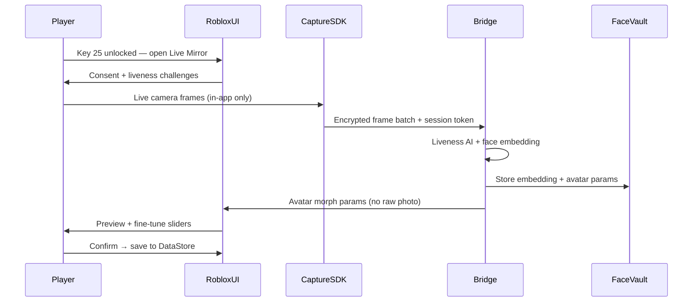

# Prism Face Creation System

**Version:** 0.1 · **Date:** 8 มิถุนายน 2026  
**Scope:** สร้างใบหน้าตัวละคร · Template + Live Camera (Key 25) · PDPA-aligned

---

## 1. สองโหมดสร้างใบหน้า

| โหมด | เงื่อนไข | คำอธิบาย |
|------|---------|----------|
| **Template Forge** | ผู้เล่นใหม่ทุกคน | เลือกจาก preset หลายแบบ + ปรับ slider เบื้องต้น |
| **Prism Live Mirror** | กุญแจครบ **25 ดอก** | ถ่ายใบหน้าสดผ่านแอป Utopia of Eternity เท่านั้น → AI แปลงเป็น avatar |

---

## 2. Template Forge (โหมด 1)

### Flow

```
Onboarding → Template Gallery → Pick base → Sliders → Preview → Confirm → Save
```

### Template categories

| หมวด | จำนวน MVP | ตัวอย่าง |
|------|-----------|----------|
| Prism Classic | 12 | Soft round, angular, heart, oval |
| Solarpunk Hero | 8 | Strong jaw, bright eyes |
| Gentle Spirit | 8 | Soft features, wide smile |
| Nocturne Edge | 6 | Sharp cheek, twilight tone |

**รวม MVP:** 34 templates (ขยายเป็น 50+ post-launch)

### Sliders (Template mode)

- ผิว · ตา · คิ้ว · จมูก · ปาก · หู · ทรงผม (preset list)
- ไม่ใช้ภาพถ่ายจริง

### ร้านที่เกี่ยวข้อง

- **Eternity Aesthetics Clinic** — ปรับ preset หลังสร้างตัว (Robux)
- **Stellar Salon** — ทรงผม / สีผม

---

## 3. Prism Live Mirror (โหมด 2 — Key 25)

### แรงบันดาลใจ

ระบบ **liveness verification** แบบธนาคาร:

- ถ่ายใบหน้า **สด** เท่านั้น (ไม่รับอัปโหลดจากแกลเลอรี)
- ตรวจ liveness: กระพริบตา · หันซ้าย/ขวา · ยิ้ม (random challenge)
- บันทึก **face embedding** เข้าระบบเพื่อเปรียบเทียบครั้งถัดไป
- ใช้เฉพาะ **Utopia of Eternity official client** (Roblox experience + companion capture SDK)

### PDPA / Privacy rules

| กฎ | รายละเอียด |
|----|------------|
| **No gallery upload** | ห้ามเลือกไฟล์จากเครื่อง — ลดความเสี่ยงใช้ภาพคนอื่น |
| **Live camera only** | เปิดกล้องในแอป → capture session มี TTL |
| **Consent screen** | ยอมรับก่อนถ่าย · อธิบายการเก็บ/ใช้ข้อมูล |
| **Server-side storage** | เก็บ embedding + audit hash — **ไม่** ส่ง raw photo ไป client อื่น |
| **Retention** | embedding เก็บตาม account · ลบได้ตามคำขอผู้ใช้ (DSAR) |
| **Minor protection** | อายุ < 13 ใช้ Template เท่านั้น (Roblox policy) |
| **Re-verify** | เปลี่ยนใบหน้าหลักต้อง live capture ใหม่ + match กับ embedding เดิม |

### Technical flow



### Fine-tune หลัง AI (ยังคงปรับได้)

- ทรงผม · จมูก · ปาก · หู · คิ้ว · แต่งหน้า
- พื้นฐานโครงหน้ามาจาก AI — slider ขยับใน safe range

### จุดติดตั้งในเมือง

- **Eternity Aesthetics Clinic** ชั้น 22 — ห้อง Prism Live Mirror (peace zone)
- ป้าย: "ปลดล็อกที่กุญแจ 25 ดอก"

---

## 4. Key progression (อัปเดต)

| กุญแจ | ปลดล็อก |
|-------|---------|
| 10 | เข้า-ออก Eternity City เสรี |
| 11 | Canal + Hover Showroom |
| 15 | Sky Rail + Premium Shop |
| 20 | Full city + Sky Lounge + 1 free legendary weapon |
| **25** | **Prism Live Mirror** (ถ่ายใบหน้าสด) |

---

## 5. Implementation files

| ไฟล์ | หน้าที่ |
|------|---------|
| `PrismFaceConfig.luau` | Templates, unlock key, liveness challenges |
| `PrismFaceService.server.luau` | Server gate key 25, save morph params |
| `PrismLiveMirror.client.luau` | UI flow, SDK bridge (MVP: stub) |
| `bridge/face_capture/` | Liveness + embedding (Phase 2 — local Bridge) |

**MVP รอบนี้:** Config + docs + clinic greybox kiosk + key gate stub

**ไม่ทำรอบนี้:** Bridge AI inference, real camera SDK, DataStore encryption

---

## 6. Security notes

- Session token one-time · หมดอายุ 5 นาที
- Rate limit: 3 capture attempts / 24h
- SevereOffenseGate ถ้าตรวจพบ deepfake pattern
- ไม่เก็บ raw photo ใน ReplicatedStorage / client cache
