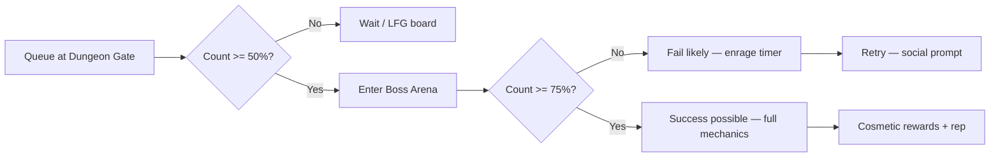

# Social Dungeon System — ทุกเมือง

**Version:** 0.1 · **Date:** 8 มิถุนายน 2026  
**Scope:** Co-op dungeons 2 / 5 / 10 / 20 / 50 · 50% เข้า · 75% ชนะ  
**Config:** `PrismDungeonConfig.luau`

---

## 1. เป้าหมายการออกแบบ

> **ปลูกนิสัยเข้าสังคม:** เข้าคนเดียว = เข้าได้แต่**ไม่รอด** · ต้องมีเพื่อน/ทีม

| หลักการ | รายละเอียด |
|---------|------------|
| Solo | อนุญาต queue คนเดียว · boss tuning ทำให้ **fail by design** |
| 50% threshold | ครบ **ครึ่งหนึ่ง**ของขนาดทีมที่ประกาศ → **เปิดประตูล่าบอสได้** |
| 75% threshold | ครบ **75%** → **โอกาสชนะ** (HP pool / mechanic ครบ) |
| ไม่ hard-lock คนเดียว | ให้ลองและเรียนรู้ · UI บอกชัดว่าต้องการเพื่อน |
| Cosmetic only | รางวัลไม่ P2W |

---

## 2. สูตรจำนวนผู้เล่น

สำหรับขนาดทีม **N** ∈ {2, 5, 10, 20, 50}:

```
minToEnterBoss  = ceil(N × 0.50)
minToSucceed    = ceil(N × 0.75)
```

| N | เข้าล่าบอส (50%) | ชนะ (75%) |
|---|------------------|-----------|
| 2 | 1 | 2 |
| 5 | 3 | 4 |
| 10 | 5 | 8 |
| 20 | 10 | 15 |
| 50 | 25 | 38 |

**หมายเหตุ:** ที่ 50% ประตูเปิด · boss enrage / spirit flood สูง — **ตั้งใจให้ wipe ถ้าไม่ถึง 75%**

---

## 3. Flow



---

## 4. Dungeons ต่อเมือง

### Place 1 — Utopia Plaza Hub

| Dungeon ID | ชื่อ | Theme | Boss |
|------------|------|-------|------|
| `hub_museum_vault` | Museum Vault | Puzzle + lore | **Curator Phantom** |
| `hub_fountain_depths` | Fountain Depths | Water/cipher | **Prism Drowned Echo** |

### Place 2 — Solhaven

| Dungeon ID | ชื่อ | Theme | Boss |
|------------|------|-------|------|
| `sol_garden_catacombs` | Garden Catacombs | Root maze | **Bloom Wraith** |
| `sol_lighthouse_deep` | Lighthouse Deep | Light/beam sync | **Beacon Keeper Shade** |

### Place 3 — Nocturne Alley

| Dungeon ID | ชื่อ | Theme | Boss |
|------------|------|-------|------|
| `noc_jazz_understage` | Jazz Understage | Rhythm clue | **Maestro Shadow** |
| `noc_clock_undercroft` | Clock Undercroft | 3:33 cipher | **Tick Titan Echo** |

### Place 4 — Utopia of Eternity

| Dungeon ID | ชื่อ | Theme | Boss |
|------------|------|-------|------|
| `et_data_vault_raid` | Data Vault Raid | Cipher tower | **Archive Sentinel** |
| `et_skyrail_maintenance` | Sky Rail Maintenance | Vertical rail | **Conductors' Ghost** |

### Place 5 — หุบเขามรณะ (Hellbound) — **Mega Dungeon**

> **Full spec:** `docs/DEATH-VALLEY-MEGA-DUNGEON.md` · 5 โซน 2→50 · กุญแจ 1/คน/โซน · loadout บทบาท

| Dungeon ID | ชื่อ | Theme | Boss |
|------------|------|-------|------|
| `dv_mega_abyss` | Mega Abyss (5 zones) | Progressive raid | Triad Wraith Sovereign |

---

## 5. Team Size Tiers (ทุก dungeon)

แต่ละ dungeon เปิด queue **5 ขนาด**:

| Tier | Label | ใช้เมื่อ |
|------|-------|---------|
| `duo` | ทีม 2 | คู่เพื่อน |
| `squad` | ทีม 5 | party เล็ก |
| `raid10` | ทีม 10 | guild เริ่มต้น |
| `raid20` | ทีม 20 | event สัปดาห์ |
| `raid50` | ทีม 50 | mega event / server celebration |

---

## 6. UI / Social

| องค์ประกอบ | รายละเอียด |
|------------|------------|
| **LFG Board** | ที่ Sanctuary ทุกเมือง — โพสต์ "ต้องการ 3/5" |
| **Friend invite** | Roblox Party + in-game code |
| **Solo warning** | "You can enter alone — survival chance: **Very Low**" |
| **75% banner** | เมื่อถึง 75% → "Team strength: **Ready**" |
| **Post-fail** | "Recruit N more allies" + teleport กลับ Sanctuary |

---

## 7. รางวัล (Cosmetic)

- Emote · title · dungeon-exclusive aura fragment
- Codex pages · Prism Key clue shards (ไม่ใช่ pay gate)
- **ไม่มี** stat weapon/armor

---

## 8. Security

- Headcount server-authoritative
- ไม่นับ AFK > 60s ใน chamber
- GriefingGuard ใน co-op instance
- Emulator cluster limit ใช้กับ raid50

---

## 9. Implementation Roadmap

| Phase | งาน |
|-------|-----|
| MVP | Config + dungeon gate greybox + queue UI stub |
| 1 | 1 dungeon / city (duo + squad) |
| 2 | Raid10–20 |
| 3 | Raid50 mega event |

**Module:** `PrismDungeonConfig.luau`  
**Server (future):** `ServerScriptService/Dungeon/DungeonQueueService.server.luau`
