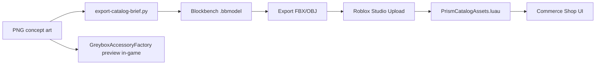

# UGC Mesh Pipeline — Concept → Blockbench → Roblox Catalog

**Version:** 0.1 · **Date:** 8 มิถุนายน 2026

---

## 1. Workflow



---

## 2. Blockbench setup

1. Install [Blockbench](https://www.blockbench.net/) 4.9+
2. New project → **Modded Entity** (Roblox R15 accessory template)
3. Reference concept PNG side-by-side
4. Target poly budget:
   - Hat/Accessory: **< 2,000 tris**
   - Shirt layer: **< 3,500 tris**
   - Back item: **< 4,000 tris**

### Naming convention

```
{item_id}.bbmodel
Example: silk_horizon_blouse.bbmodel
```

Store under: `assets/ugc/blockbench/`

---

## 3. Export steps

| Step | Action |
|------|--------|
| 1 | File → Export → **Roblox Mesh** (.mesh) or FBX |
| 2 | Studio → Avatar → **Bulk Import** |
| 3 | Set accessory type: Hat / Hair / Face / Back / Shoulder |
| 4 | Copy **Asset ID** from Creator Dashboard |
| 5 | Register in `PrismCatalogAssets.luau`: `registerMesh(itemId, assetId)` |
| 6 | Create **Developer Product** → `registerProduct(itemId, productId)` |

---

## 4. Greybox preview (until UGC ready)

`GreyboxAccessoryFactory.luau` spawns simple Neon parts on avatar for shop preview:

```lua
GreyboxAccessoryFactory:EquipPreview(player, "silk_horizon_blouse", "Shirt")
```

Colors from Prism Solarpunk palette (pearl / gold / cyan).

---

## 5. Tier S briefs (เริ่มที่นี่)

**4 ชุดแรก:** Coquette · Old Money · Gothic · Preppy

- Index: [`blockbench-briefs/TIER-S-INDEX.md`](blockbench-briefs/TIER-S-INDEX.md)
- Manifest: `assets/ugc/blockbench/tier-s/manifest.json`
- VFX (aura): `CoquetteSoftAura.luau`, `GothicTwilightAura.luau`

## 6. Generate briefs from catalog

```bash
cd utopia-of-eternity-game
python3 tools/ugc/export-catalog-brief.py
```

Output: `docs/ugc/CATALOG-BRIEF.md` — one row per item with concept path, slot, robux.

---

## 7. Pre-publish checklist

- [ ] Every `piece.id` in `PrismFashionCatalog` has `UgcMeshes[id]` OR greybox fallback
- [ ] Every purchasable item has `DeveloperProducts[id]` in Creator Dashboard
- [ ] IP audit: no franchise shapes
- [ ] Mobile LOD test < 2k tris per accessory
